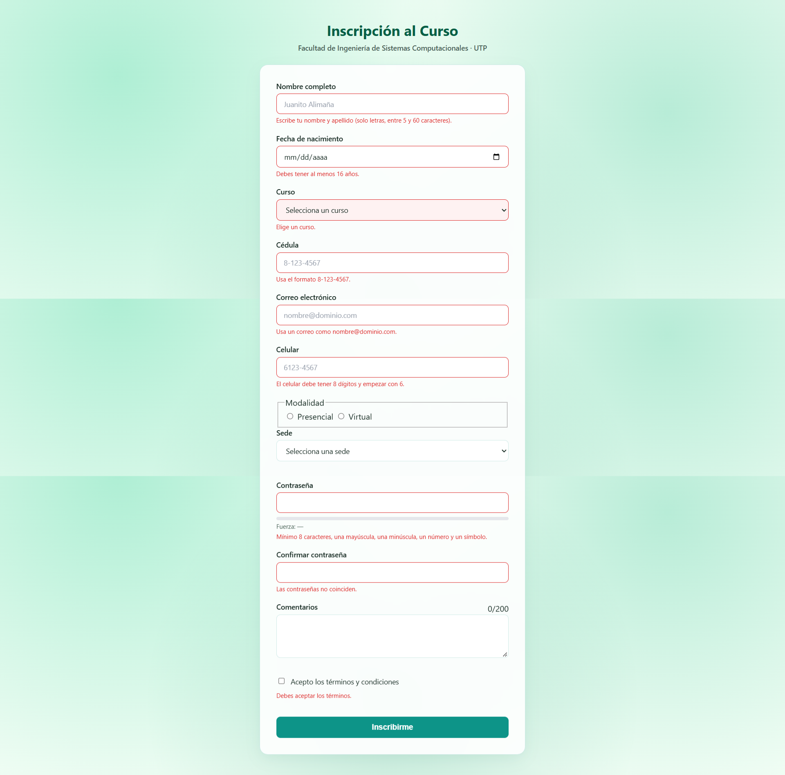

# Laboratorio DOM y Validación de Formularios
**Ingeniería Web — Tarea 4**  
**Facultad de Ingeniería de Sistemas Computacionales (FISC)**  
**Universidad Tecnológica de Panamá**

---

### Integrantes
* **Walter Gonzalez** 
* **Hector Vargas** 

---

### Enlaces de Entrega
* **Repositorio de GitHub:**  
  `https://github.com/WalterJoel18/Gonzalez-Walter-Vargas-Hector-lab-dom`
* **Despliegue GitHub Pages:**  
  ` https://walterjoel18.github.io/Gonzalez-Walter-Vargas-Hector-lab-dom/`

---

### Evidencias de Funcionamiento

#### 1. Formulario con Errores de Validación Activos
> Resaltado visual en rojo de los campos que incumplen las reglas.

---

#### 2. Envío Exitoso y Confirmación
> Tarjeta de confirmación en el DOM con los datos registrados tras una validación exitosa (sin que se vean las contraseñas).

